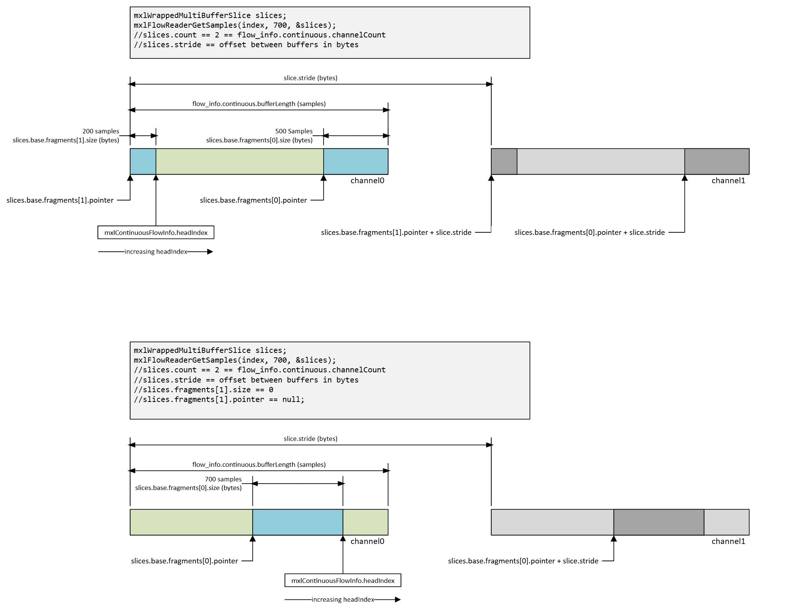

# Continuous Ring Buffer I/O

Continuous ringbuffers are used in the MXL SDK for handling audio data, where samples are written and read in a continuous, streaming fashion. This section describes the structure, memory layout, and access patterns for continuous ringbuffers in MXL.

## `mxlContinuousFlowConfigInfo` in Context

The MXL SDK provides APIs such as `mxlFlowReaderGetInfo`, `mxlFlowReaderGetConfigInfo`, `mxlFlowWriterGetInfo`, and `mxlFlowWriterGetConfigInfo` to retrieve configuration and runtime information about flows. For continuous flows, the configuration includes:

| Field            | Type        | Meaning                                                        |
|------------------|-------------|----------------------------------------------------------------|
| `channelCount`   | `uint32_t`  | Number of de-interleaved channel ring buffers allocated.       |
| `bufferLength`   | `uint32_t`  | Number of sample slots in each channel buffer.                 |
| `reserved`       | `uint8_t[56]` | Zeroed padding for structure alignment.                      |

The common block preceding the continuous block provides additional information:
- `grainRate`: Sample rate (numerator/denominator rational).
- `format`: Payload format (e.g., `audio/float32`).
- `maxCommitBatchSizeHint` / `maxSyncBatchSizeHint`: Hints for batch sizes.
- `payloadLocation` and `deviceIndex`: Indicate if samples are in host RAM or device memory.

Example usage:
```c
mxlFlowInfo info = {};
MXL_THROW_IF_FAILED(mxlFlowReaderGetInfo(reader, &info));

const mxlContinuousFlowConfigInfo *continuous = &info.config.continuous;
const uint32_t channelCount = continuous->channelCount;
const uint32_t channelBufferLength = continuous->bufferLength;
const mxlRational sampleRate = info.config.common.grainRate;
// sampleRate == samples per second for continuous flows
```

## Memory Layout of Continuous Flow Info

The flow metadata file `${mxlDomain}/${flowId}.mxl-flow/data` contains a single `mxlFlowInfo` object with the following organization:

```
Offset   Size   Description
0x0000   0x04   version (currently 1)
0x0004   0x04   size (must stay 2048)
0x0008   0x80   mxlCommonFlowConfigInfo  (ID, format, rate, batch hints, payload info)
0x0088   0x40   mxlContinuousFlowConfigInfo (channelCount, bufferLength, reserved)
0x00C8   0x40   mxlFlowRuntimeInfo (headIndex, lastWriteTime, lastReadTime, reserved)
0x0108   0x6F8  reserved padding to keep the struct cache-line aligned
```

The actual audio samples are stored in `${mxlDomain}/${flowId}.mxl-flow/channels`, a shared memory blob of size `channelCount * bufferLength * sampleWordSize` bytes. The layout is:

- channel 0 buffer (bufferLength * sampleWordSize bytes)
- channel 1 buffer (bufferLength * sampleWordSize bytes)
- ...
- channel N-1 buffer

Each channel buffer is a classic circular buffer. The API exposes this geometry through `mxlWrappedMultiBufferSlice`, which provides two fragments (`base.fragments[0]` and `base.fragments[1]`) to handle wrap-around, and a `stride` for channel separation.

## Accessing Samples

To read a window of samples:

1. Specify the absolute sample index (`index`) for the last sample.
2. Specify the number of samples to look backwards by (`count`), not exceeding `bufferLength / 2`.
3. Specify a timeout (`timeoutNs`).

`mxlFlowReaderGetSamples` and `mxlFlowReaderGetSamplesNonBlocking` fill an `mxlWrappedMultiBufferSlice` pointing into the channel buffer blob.

Example pseudocode for reading `audio/float32` samples:
```c
// Read the latest 256 samples per channel, waiting up to 5 ms.
mxlWrappedMultiBufferSlice slices;
mxlFlowRuntimeInfo runtime;
mxlFlowReaderGetRuntimeInfo(reader, &runtime);

const uint64_t lastSample = runtime.headIndex;
const size_t windowLength = 256;
mxlFlowReaderGetSamples(
    reader,
    lastSample,
    windowLength,
    5'000'000,  // 5 milliseconds
    &slices);

const size_t channels = slices.count;
const size_t strideBytes = slices.stride;
const size_t fragment0Samples = slices.base.fragments[0].size / sizeof(float);
const size_t fragment1Samples = slices.base.fragments[1].size / sizeof(float);

for (size_t channel = 0; channel < channels; ++channel) {
    const uint8_t *channelBase0 = static_cast<const uint8_t *>(slices.base.fragments[0].pointer) + channel * strideBytes;
    const uint8_t *channelBase1 = static_cast<const uint8_t *>(slices.base.fragments[1].pointer) + channel * strideBytes;

    const float *firstSlice = reinterpret_cast<const float *>(channelBase0);
    const float *secondSlice = reinterpret_cast<const float *>(channelBase1);

    // Process the first fragment (may already contain the entire window).
    for (size_t i = 0; i < fragment0Samples; ++i) {
        consume_sample(channel, firstSlice[i]);
    }

    // Only needed when the window wrapped around the ring buffer.
    for (size_t i = 0; i < fragment1Samples; ++i) {
        consume_sample(channel, secondSlice[i]);
    }
}
```

Writing samples uses `mxlMutableWrappedMultiBufferSlice` in a similar pattern.

### Important Rules

- Readers can only observe up to `bufferLength / 2` samples in one call; the other half is "write in progress."
- `index` is inclusive: `(headIndex, 256)` returns samples `headIndex - 255` through `headIndex`.
- Always treat the window as two contiguous slices.
- Continuous flows use the same slice/fragment helpers as discrete flows.


